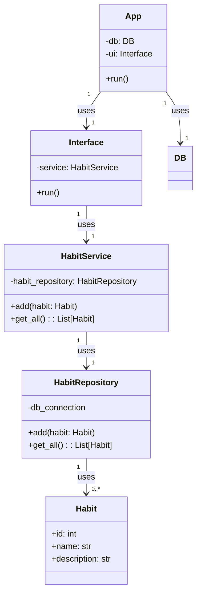

```mermaid
classDiagram
    class Habit {
        +id: int
        +name: str
        +description: str
    }

    class HabitRepository {
        -db_connection
        +add(habit: Habit)
        +get_all(): List[Habit]
    }

    class HabitService {
        -habit_repository: HabitRepository
        +add(habit: Habit)
        +get_all(): List[Habit]
    }

    class Interface {
        -service: HabitService
        +run()
    }

    class DB {
    }

    class App {
        -db: DB
        -ui: Interface
        +run()
    }

    HabitRepository "1" --> "0..*" Habit : uses
    HabitService "1" --> "1" HabitRepository : uses
    Interface "1" --> "1" HabitService : uses
    App "1" --> "1" DB : uses
    App "1" --> "1" Interface : uses
```