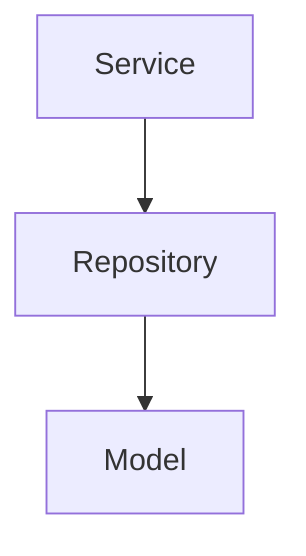
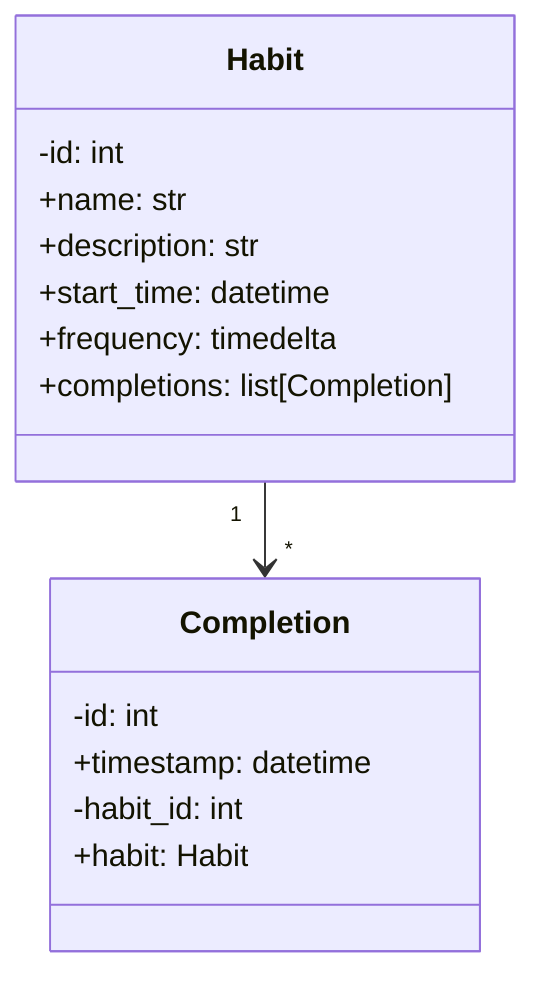
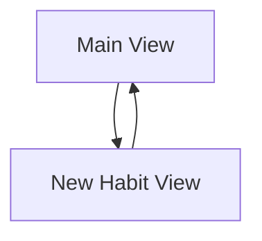
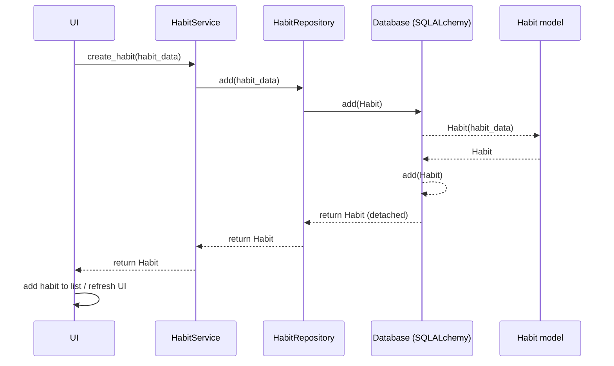
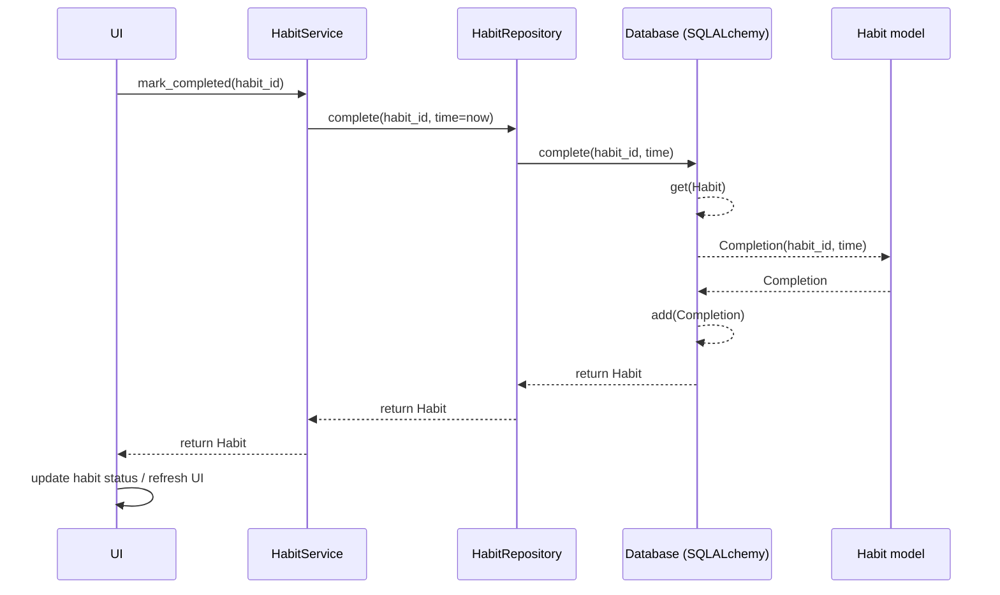

# Architecture

## Structure Overview
The application is structured into two key constructs:
- Application Logic
- User Interface

Application logic provides the functionality of the application, while the user interface handles user interactions.

## Application Logic
Application logic follows the repository design principle with 3 main abstraction layers:
- Model
- Repository
- Service

### Model
Models represent entities in the application. The `Habit` model defines the structure of a habit. The `Completion` model tracks when a habit has been completed.

### Repository
The repository layer handles data persistence and access. The `HabitRepository` class provides methods for performing CRUD operations on the `Habit` model. `HabitRepository` uses an SQLite database via SQLAlchemy ORM.

### Service
The service layer contains all logic required by the user interface. The `HabitService` class uses `HabitRepository` for CRUD operations. Currently it does not implement additional logic, only some basic error handling.

## User Interface
The user interface is implemented using `tkinter`. There are two main views:

### Main View
Displays a list of habits with their information and status.
Allows users to mark habits as completed for the current interval.

### New Habit View
Provides a form for users to create new habits by entering the required details.

### User Interface Flow

### User Interface and Application Logic Interaction
All interaction with the application logic is done through the `HabitService` class.

## Application Flow

### Create a New Habit

Description:
- The UI gets and validates form input and calls `HabitService.create_habit(habit_data)`.
- `HabitService.create_habit` calls `HabitRepository.add(habit_data)`.
- `HabitRepository.add(habit_data)` constructs a `Habit` ORM object, loads its `completions` relationship and returns a detached `Habit` object.
- The service receives the `Habit` and returns it to the UI, which adds it to the habit list and refreshes the view.

### Mark a Habit As Done

Description:
- The UI triggers `HabitService.mark_completed(habit_id)` when the "complete" button is pressed.
- `HabitService.mark_completed(habit_id)` calls `HabitRepository.complete(habit_id, time=now)`.
- `HabitRepository.complete(habit_id, time)` loads the `Habit` and its `Completion`s, then calls `habit.completed(time)` to determine whether a completion already exists for the corresponding interval.
- If the habit has not yet been completed for that interval, the repository appends a new `Completion(time=time)` to `habit.completions`, and returns the updated `Habit` object.
- The service returns the updated Habit object to the UI, which updates the habit completion status and refreshes the view.

Generally the interaction between the user interface and application logic follows the same pattern. Changes in the UI trigger service methods, which in turn call repository methods to interact with the database. The results are passed back up to the UI for display and updates.
