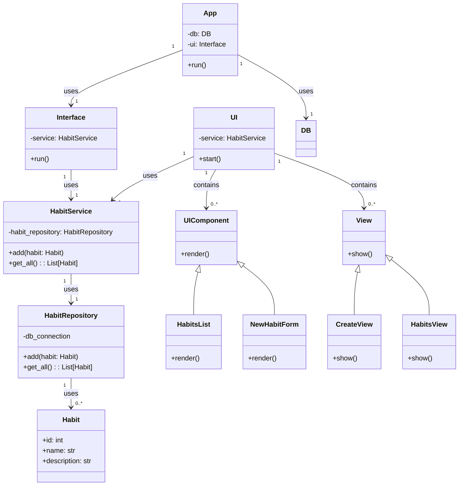
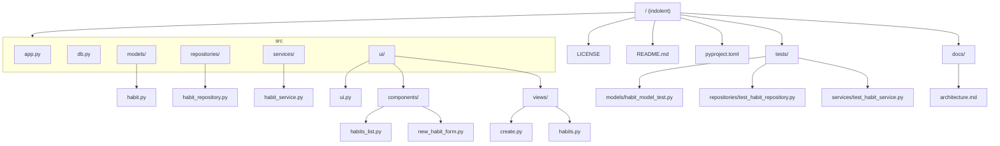

```mermaid
classDiagram
    class Habit {
        +id: int
        +name: str
        +description: str
    }

    class HabitRepository {
        -db_connection
        +add(habit: Habit)
        +get_all(): List[Habit]
    }

    class HabitService {
        -habit_repository: HabitRepository
        +add(habit: Habit)
        +get_all(): List[Habit]
    }

    class Interface {
        -service: HabitService
        +run()
    }

    class UI {
        -service: HabitService
        +start()
    }

    class UIComponent {
        +render()
    }

    class HabitsList {
        +render()
    }

    class NewHabitForm {
        +render()
    }

    class View {
        +show()
    }

    class CreateView {
        +show()
    }

    class HabitsView {
        +show()
    }

    class DB {
    }

    class App {
        -db: DB
        -ui: Interface
        +run()
    }

    HabitRepository "1" --> "0..*" Habit : uses
    HabitService "1" --> "1" HabitRepository : uses
    Interface "1" --> "1" HabitService : uses
    UI "1" --> "1" HabitService : uses
    UIComponent <|-- HabitsList
    UIComponent <|-- NewHabitForm
    View <|-- CreateView
    View <|-- HabitsView
    UI "1" --> "0..*" UIComponent : contains
    UI "1" --> "0..*" View : contains
    App "1" --> "1" DB : uses
    App "1" --> "1" Interface : uses
```

```mermaid
graph TD
    root["/ (indolent)"]
    subgraph src
        app["app.py"]
        db["db.py"]
        models_dir["models/"]
        repos_dir["repositories/"]
        services_dir["services/"]
        ui_dir["ui/"]
    end

    models_dir --> habit_py["habit.py"]
    repos_dir --> habit_repo["habit_repository.py"]
    services_dir --> habit_service["habit_service.py"]
    ui_dir --> ui_py["ui.py"]
    ui_dir --> ui_components["components/"]
    ui_dir --> ui_views["views/"]
    ui_components --> habits_list["habits_list.py"]
    ui_components --> new_habit_form["new_habit_form.py"]
    ui_views --> create_view["create.py"]
    ui_views --> habits_view["habits.py"]

    tests_dir["tests/"]
    tests_dir --> models_test["models/habit_model_test.py"]
    tests_dir --> repos_test["repositories/test_habit_repository.py"]
    tests_dir --> services_test["services/test_habit_service.py"]

    docs_dir["docs/"]
    docs_dir --> arch_md["architecture.md"]

    root --> src
    root --> tests_dir
    root --> docs_dir
    root --> license["LICENSE"]
    root --> readme["README.md"]
    root --> pyproject["pyproject.toml"]
```
