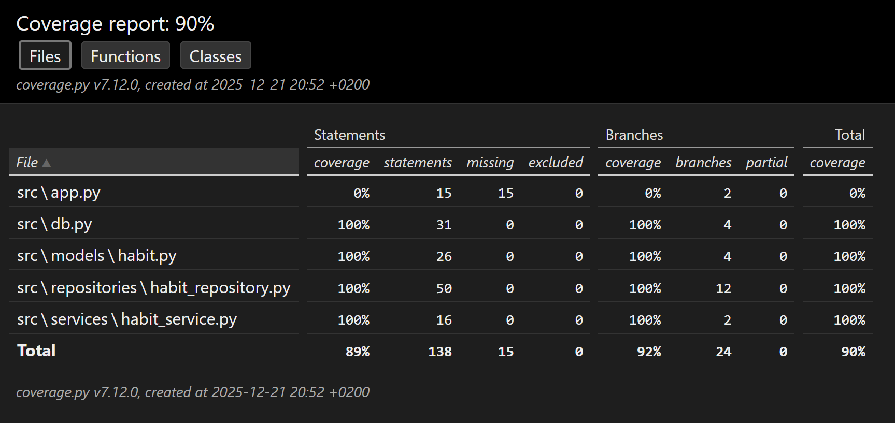

# Testing
This document outlines testing implemented in the app.

## Unit Tests
Unit tests are implemented using the `unittest` framework.

Unit test coverage for the application logic is 100%.
The app layer has not been tested with unit tests, as it mainly consists of UI code using `tkinter`.

### Habit
Tests for the `Habit` model are located in `tests/models/test_habit_model.py`.
The tests use standalone instances of the `Habit` class without a database.
These tests cover:
- Creation of `Habit` instances
- Validation of `Habit` and `Completion` attributes via the `__repr__` method
- Logic for completing habits and checking completion status

### HabitRepository
Tests for the `HabitRepository` class are located in `tests/repositories/test_habit_repository.py`.
These tests use an in-memory SQLite database.
These tests cover:
- CRUD operations for `Habit` instances
- Completion logic

### HabitService
Tests for the `HabitService` class are located in `tests/services/test_habit_service.py`.
These tests use an instance of `HabitRepository` that uses an in-memory SQLite database.
Since the `HabitService` class currently does not implement additional logic beyond calling the repository methods, the tests mainly ensure that the service layer correctly calls the repository layer.
These tests cover:
- Service layer calls for CRUD operations
- Raising an error when trying to create a habit with a name that already exists

## Integration Tests
Integration tests have been implemented with unit tests for the `HabitService` and `HabitRepository` classes, as they use their actual dependencies in tests.

## User Interface Tests
Interface testing has been done manually by running the application and testing the main user flows:
- Launching the application with and without existing habits
- Creating new habits via the New Habit View
- Marking habits as completed in the Main View
- Scrolling through a long list of habits in the Main View
- Verifying that habits reset their completion status based on their frequency
